# Sprite Detection

## Sprite

A [**sprite**](<https://en.wikipedia.org/wiki/Sprite_(computer_graphics)>) is a small [**raster graphic**](https://en.wikipedia.org/wiki/Raster_graphics) (a **bitmap**) that represents an object such as a character, a vehicle, a projectile, etc.

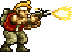

Sprites are a popular way to create large, complex scenes as you can manipulate each sprite separately from the rest of the scene. This allows for greater control over how the scene is rendered, as well as over how the players can interact with the scene.

Sprites are mainly used in 2D video games, such as [Shoot'em up](https://en.wikipedia.org/wiki/Shoot_%27em_up) in which the hero combats a large number of enemies by shooting at them while dodging their fire:

| [Cannon Fodder](<https://en.wikipedia.org/wiki/Cannon_Fodder_(video_game)>) | [Commando](<https://en.wikipedia.org/wiki/Commando_(video_game)>) | [Metal Slug](https://en.wikipedia.org/wiki/Metal_Slug) |
| --------------------------------------------------------------------------- | ----------------------------------------------------------------- | ------------------------------------------------------ |
| 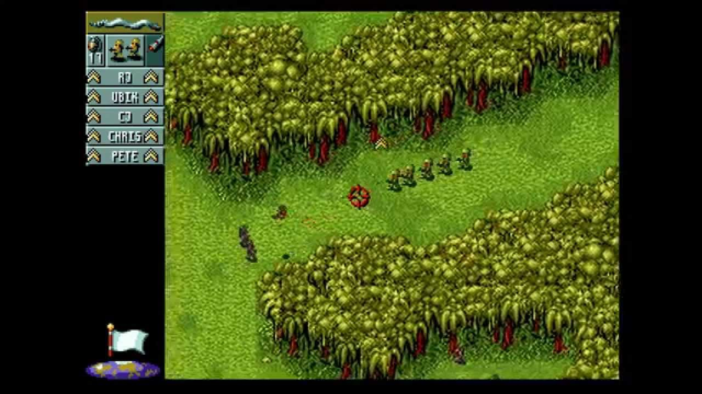                           | 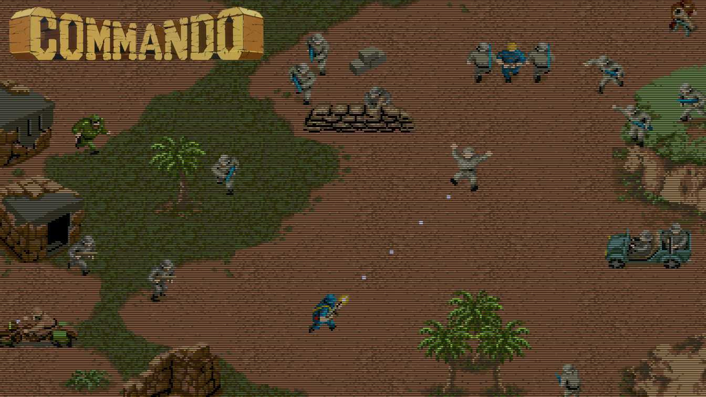                           | 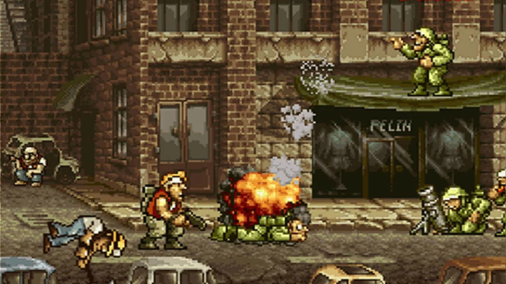            |

## Sprite Animation

Several sprites, representing a same object, can be rendered in quick succession to give the illusion of movement of this object (**animation**).

For example, the animation of the hero Marco Rossi (Metal Slug), running with a gun, is composed of 9 sprites:

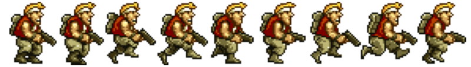

## Sprite Sheet

It is not uncommon for games to have tens to hundreds of sprites. Loading each of these as an individual image would consume a lot of memory and processing power. To help manage sprites and avoid using so many images, many games use **sprite sheets** (also known as **image sprites**).

A sprite sheet consists of multiple sprites in one image. In other words, sprite sheets pack multiple sprites into a single picture. Using sprite sheet, video game developers create sprite sheet animation representing one or several animation sequences while only loading a single file:

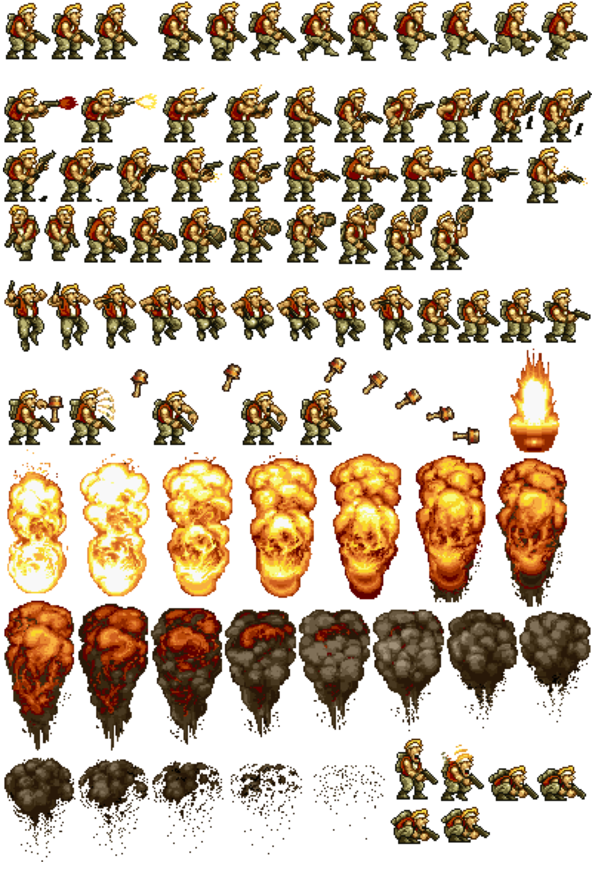

## Sprite Bounding Box

A frame (**bounding box**) can be used to delimit the sprite in the sprite sheet. This bounding box is defined with two 2D points `top_left` and the `bottom_right`, which their respective coordinates `x` and `y` are relative to the top-left corner of the sprite sheet's image.

For example:

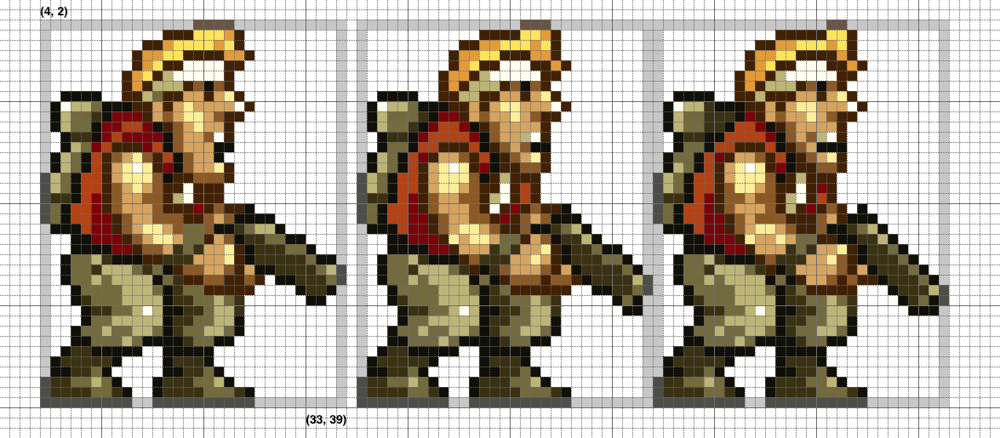

## Sprite Mask

The mask of a sprite defines the 2D shape of the sprite. For example, the sprite sheet [`metal_slug_sprite_standing_stance.png`](metal_slug_sprite_standing_stance_large.png) contains the 3 following sprites:

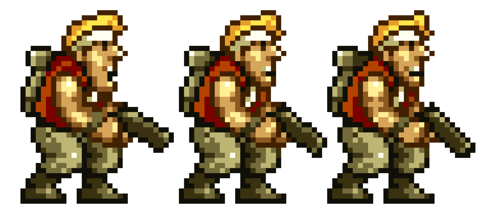

The masks of these sprites are respectively:

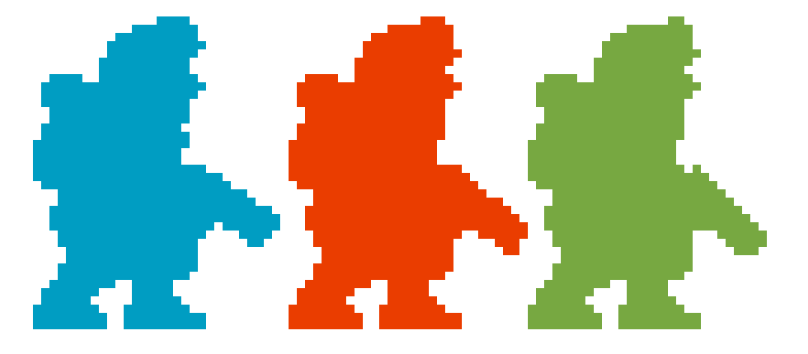

## Optimized Sprite Sheet

Sprites could be evenly placed in the sprite sheet according to their bounding box. The disadvantage is that this method of placement wastes a lot of memory because of all the additional transparency of each sprite, especially when sprites have different width and height.

The developers are aware of the wasted memory and started to optimize the space in the sprite sheets. Sprites are placed close to each others, depending on their shape. The bounding box of a sprite may intersect the bounding box of another sprite, but the shape of this sprite is always separated from the shape of any other sprites with at least 1 transparent pixel.

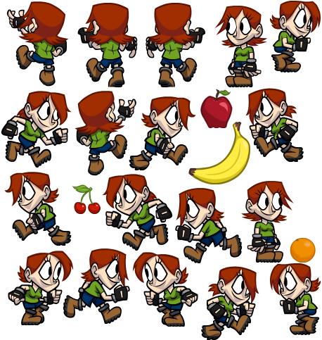

This space optimization is even more efficient when some big sprites have concave shape (i.e., shape that curves inward):

| Scene with 2 Sprites    | Sprite Sheet                                 | Sprite Masks                                      |
| ----------------------- | -------------------------------------------- | ------------------------------------------------- |
| 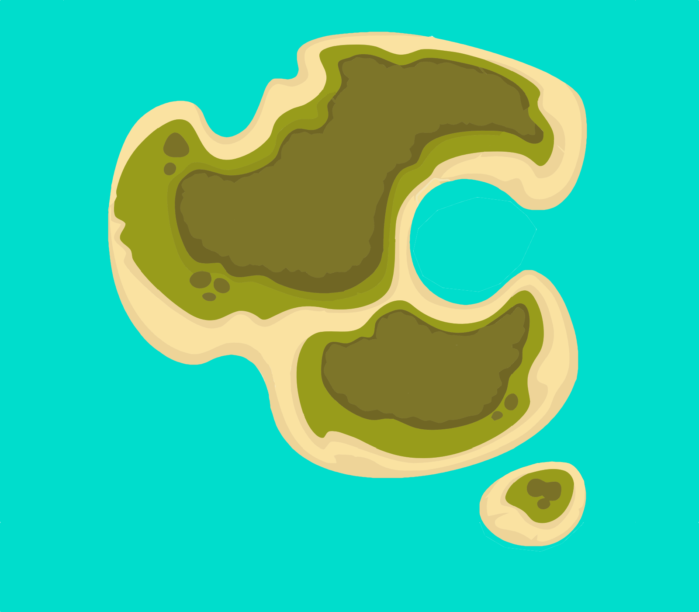 | 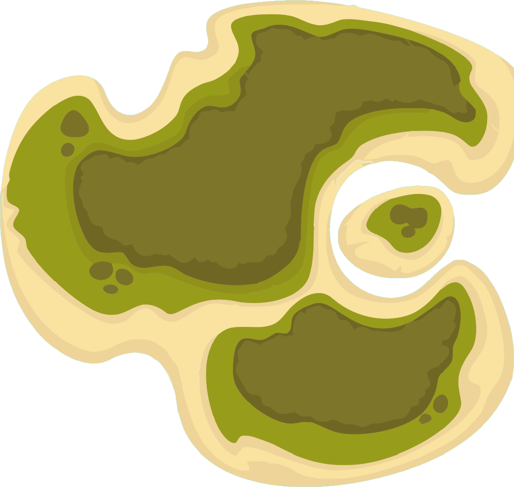 |  |

# Waypoint 1: Find the Most Common Color in an Image

Write a function `find_most_common_color` that takes an argument `image` (a [`Image`](https://pillow.readthedocs.io/en/stable/reference/Image.html) object) and that returns the pixel color that is the most used in this image.

The data type of the value returned depends on the [image's mode](https://pillow.readthedocs.io/en/stable/handbook/concepts.html#concept-modes):

- an integer if the mode is grayscale;
- a tuple `(red, green, blue)` of integers if the mode is `RGB`;
- a tuple `(red, green, blue, alpha)` of integers if the mode is `RGBA`.

For example:

```python
>>> from PIL import Image
# JPEG image
>>> image = Image.open('islands.jpg')
>>> image.mode
'RGB'
>>> find_most_common_color(image)
(0, 221, 204)
# PNG image
>>> image = Image.open('metal_slug_sprite_standing_stance_large.png')
>>> image.mode
'RGBA'
>>> find_most_common_color(image)
(0, 0, 0, 0)
# Grayscale image
>>> image = image.convert('L')
>>> image.mode
'L'
>>> find_most_common_color(image)
152
```

_Note 1: Python is an interpreted, high-level, general-purpose programming language. Pure Python code is not great at processing large amount of data. However, Python comes with a large number of libraries written in [`C`](<https://en.wikipedia.org/wiki/C_(programming_language)>) that run very fast: [`Pillow`](https://en.wikipedia.org/wiki/Python_Imaging_Library) for image processing, [`NumPy`](https://en.wikipedia.org/wiki/NumPy) for large multi-dimensional arrays and matrices, etc. You SHOULD intensively use these libraries that extend Python and that allow your Python application to be fast._

_Note 2: You SHOULD [measure the execution time](https://docs.python.org/3.7/library/timeit.html) of your code to check whether it's reasonably fast or if there is space for improvement. For example:_

```python
>>> import timeit
>>> from PIL import Image
>>> image = Image.open('islands.jpg')
>>> timeit.timeit(stmt=lambda: find_most_common_color(image), number=1)
1.6871624910000023
```

# Waypoint 2: Write a class `Sprite`

Write a class `Sprite` which constructor takes 4 arguments `x1`, `y1`, `x2`, and `y2` (integers). These arguments are used to initialize some private attributes of the class `Sprite`.

Add the two properties `top_left` and `bottom_right` to the class `Sprite` that correspond to the coordinates `(x1, y1)` (a tuple) of the top-left corner, respectively the coordinates `(x2, y2)` (a tuple) of the right-most corner.

For example:

```python
>>> sprite = Sprite(12, 23, 145, 208)
>>> sprite.top_left
(12, 23)
>>> sprite.bottom_right
(145, 208)
```

The constructor of the class `Sprite` raises an exception `ValueError` if one or more of the arguments `x1`, `y1`, `x2`, and `y2` is not positive integer, or if the arguments `x2` and `y2` is not equal or greater respectively than `x1` and `y2`.

For examples:

```python
>>> sprite = Sprite(-1, 0, 0, 0)
Traceback (most recent call last):
  File "<input>", line 1, in <module>
  File "<input>", line 11, in __init__
ValueError: Invalid coordinates
>>> sprite = Sprite("Hello", 0, 0, 0)
Traceback (most recent call last):
  File "<input>", line 1, in <module>
  File "<input>", line 13, in __init__
ValueError: Invalid coordinates
>>> sprite = Sprite(1, 0, 0, 0)
Traceback (most recent call last):
  File "<input>", line 1, in <module>
  File "<input>", line 13, in __init__
ValueError: Invalid coordinates
```

Add the two properties `width` and `height` that returns respectively the number of pixels horizontally and vertically of this sprite.

For example:

```python
>>> sprite = Sprite(12, 23, 145, 208)
>>> sprite.width
134
>>> sprite.height
186
```

# Waypoint 3: Detect the Sprites in an Image

We would like to find all the sprites packed in a single picture.

**WARNING: You are NOT ALLOWED to use any computer vision libraries (e.g. [OpenCV](https://opencv.org/) and others), but image processing (e.g., [Python Image Library](https://python-pillow.org/)) and scientific computing (e.g, [Numpy](https://numpy.org/)) libraries!**

Write a function `find_sprites` that takes an argument `image` (a [`Image`](https://pillow.readthedocs.io/en/stable/reference/Image.html) object).

This function accepts an optional argument `transparent_color` (an integer if the image format is grayscale, or a tuple `(red, green, blue)` if the image format is `RGB`) that identifies the transparent color of the image. The function ignores any pixels of the image with this color.

If this argument `transparent_color` is not passed, the function determines the transparent color of the image as follows:

1. The image, such as a PNG file, has an [alpha channel](<https://en.wikipedia.org/wiki/Transparency_(graphic)>): the function ignores all the pixels of the image which alpha component is `255`;
2. The image has no alpha channel: the function identifies the most common color of the image as the transparent color (cf. our function `find_most_common_color`).

The function returns a tuple `(sprites, sprite_mask)`
where:

- `sprites`: A dictionary where each key represents the index (integer strictly positive) of a sprite that has been found, and the respective value references the object `Sprite` of this sprite;
- `sprite_mask`: A 2D array of integers, which number of rows is equal to the height of the image object passed to the function, and which number of columns is equal to the width of this image. The `sprite_mask` array maps each pixel of the image passed to the function to the index of a sprite this pixel corresponds to, or `0` if this pixel doesn't belong to a sprite (e.g., transparent color).

_Note: The sprite indices can be whatever unique strictly positive integers, with no particular order. The index of a sprite has no particular relationship with the position of the sprite in the image._

For example, let's consider the image file [sprite_example.png](sprite_example.png) zoomed-in hereafter:


```python
>>> from PIL import Image
>>> image = Image.open('sprite_example.png')
>>> sprites, sprite_mask = find_sprites(image, transparent_color=(255, 255, 255))
>>> len(sprites)
1
>>> for sprite_index, sprite in sprites.items():
...     print(f"Sprite ({sprite_index}): [{sprite.top_left}, {sprite.bottom_right}] {sprite.width}x{sprite.height}")
Sprite (4): [(0, 0), (4, 5)] 5x6
>>> import pprint
>>> pprint.pprint(sprite_mask)
[[4, 0, 4, 0, 4],
 [4, 4, 0, 0, 4],
 [0, 0, 4, 4, 4],
 [4, 0, 0, 0, 4],
 [0, 4, 4, 0, 4],
 [0, 0, 0, 4, 0]]
```

Other example with the following image:


```python
>>> from PIL import Image
>>> image = Image.open('metal_slug_sprite_standing_stance.png')
>>> sprites, sprite_mask = find_sprites(image)
>>> len(sprites)
3
>>> for sprite_index, sprite in sprites.items():
...     print(f"Sprite ({sprite_index}): [{sprite.top_left}, {sprite.bottom_right}] {sprite.width}x{sprite.height}")
Sprite (1): [(4, 2), (33, 39)] 30x38
Sprite (2): [(35, 2), (63, 39)] 29x38
Sprite (3): [(64, 2), (92, 39)] 29x38
```

Last example with the following image:


```python
>>> image = Image.open('islands.png')
>>> sprites, sprite_mask = find_sprites(image)
>>> len(sprites)
2
>>> for sprite_index, sprite in sprites.items():
...    print(f"Sprite ({sprite_index}): [{sprite.top_left}, {sprite.bottom_right}] {sprite.width}x{sprite.height}")
Sprite (77): [(247, 72), (1343, 1093)] 1097x1022
Sprite (108): [(1097, 1055), (1341, 1249)] 245x195
```

<!--
# Waypoint: Write a class `SpriteSheet`

Write a class `SpriteSheet` which constructor accepts an argument `image` that corresponds to either:

- the name and path (a string) that references an image file in the local file system;
- a [`pathlib.Path`](https://docs.python.org/3/library/pathlib.html#pathlib.Path) object that references an image file in the local file system ;
- a [file object](https://docs.python.org/3/glossary.html#term-file-object) that MUST implement [`read()`](https://docs.python.org/3/library/io.html#io.IOBase.read), [`seek()`](https://docs.python.org/3/library/io.html#io.IOBase.seek), and [`tell()`](https://docs.python.org/3/library/io.html#io.IOBase.tell) methods, and be opened in binary mode;
- a [`Image`](https://pillow.readthedocs.io/en/stable/reference/Image.html) object.

This constructor also accepts an optional argument `transparent_color` that identifies the transparent color of the image. The type of `transparent_color` argument depends on the images' mode:

- an integer if the mode is grayscale;
- a tuple `(red, green, blue)` of integers if the mode is `RGB`;
- a tuple `(red, green, blue, alpha)` of integers if the mode is `RGBA`. The `alpha` element is optional. If not defined, while the image mode is `RGBA`, the constructor considers the `alpha` element to be `255`.
-->
